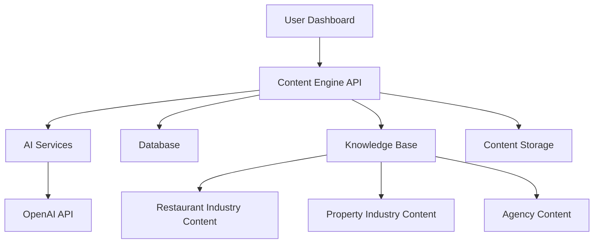
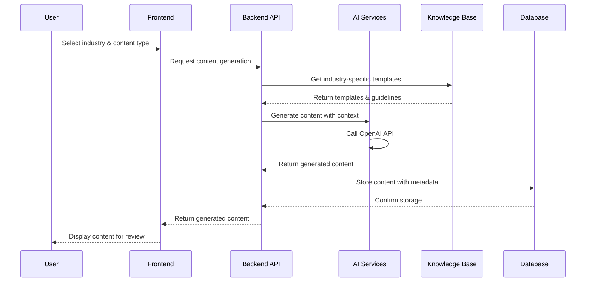

# System Architecture

## Project Overview

The Marketing SaaS Platform is designed as a multi-industry content creation and distribution system, built with a phased development approach.

## Current Phase: Content Creation Engine

### High-Level Architecture

### Core Components

#### 1. Frontend Dashboard (React.js)
- **Purpose**: User interface for content creation and management
- **Key Features**:
  - Content generation interface
  - Industry selection (Restaurant/Property/Agency)
  - Content type selection (Blog/Social/Email/Ads)
  - Content library and management
  - Export functionality

#### 2. Backend API (Node.js/Express)
- **Purpose**: Core business logic and API endpoints
- **Key Features**:
  - Content generation workflows
  - Knowledge base integration
  - User authentication
  - Content storage management
  - AI service orchestration

#### 3. AI Services
- **Purpose**: Integration with OpenAI API and content generation logic
- **Key Features**:
  - GPT-4 integration
  - Content prompt engineering
  - Industry-specific content generation
  - Content quality validation

#### 4. Database (PostgreSQL)
- **Purpose**: Structured storage for content, users, and system data
- **Key Tables**:
  - `users` - User accounts and preferences
  - `content_pieces` - Generated content with metadata
  - `knowledge_base` - Industry-specific content templates
  - `content_templates` - Reusable content structures

#### 5. Knowledge Base
- **Purpose**: Industry-specific content templates and guidelines
- **Structure**:
  - Restaurant Industry: Menu content, local food trends, event marketing
  - Property Industry: Market updates, neighborhood guides, listing content
  - Agency Content: Marketing tips, case studies, industry insights

## Data Flow

### Content Generation Workflow

## Technology Stack Decisions

### Frontend: React.js
- **Rationale**: Rich component ecosystem, excellent for dashboards, future WordPress integration
- **Key Libraries**: React Router, Axios, Tailwind CSS

### Backend: Node.js/Express
- **Rationale**: JavaScript consistency, excellent AI API integration, rapid development
- **Key Libraries**: Express, JWT, bcrypt, OpenAI SDK

### Database: PostgreSQL
- **Rationale**: Structured content storage, JSON support, scalability, WordPress compatibility
- **Key Features**: Relational data with JSON columns for flexible content storage

### AI: OpenAI API (GPT-4)
- **Rationale**: Industry-leading text generation, extensive API documentation
- **Integration**: RESTful API with prompt engineering for industry-specific content

## Security Considerations

- JWT-based authentication
- Environment variable management for API keys
- Input validation and sanitization
- Rate limiting for AI API calls
- Content access controls

## Future Architecture (Phase 2)

### WordPress Integration
- WordPress Multisite network
- REST API integration
- Automated content publishing
- Client site management

### Social Media Integration
- Facebook/Meta API
- Instagram API
- LinkedIn API
- Twitter/X API

### Email Marketing Integration
- FluentCRM integration
- Email template generation
- Automated sequences

## Development Principles

Following the AI-Assisted Development Strategy:

1. **Modularity**: Each component is self-contained with clear responsibilities
2. **Strong Guard Rails**: Version control, testing, and validation at each step
3. **Clear Context**: Well-defined APIs and data structures
4. **Human Oversight**: All AI-generated content requires review and approval
5. **Iterative Development**: Small, testable components built incrementally

## Next Steps

1. Set up development environment
2. Initialize database schema
3. Create basic API endpoints
4. Build content generation workflows
5. Implement knowledge base system
